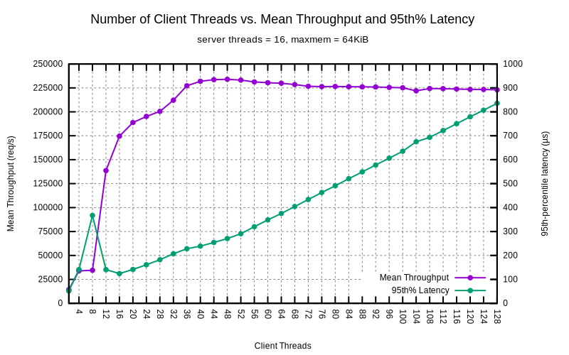

# HW6: Crank it Up!

By Aaron G. (@azggit) and Alex W. (@InternetUnexplorer)

> **NOTE:** All benchmarks were run on a Ryzen 7 2700X @ ~4300MHz (clock
> speed was not locked, see comment in multi-threaded server section)

## Building

The process for building everything has not changed since HW4.

The following dependencies are required:
- [**Boost.Asio**][1] (`cache_client`, `cache_server`)
- [**Boost.Beast**][2] (`cache_client`, `cache_server`)
- [**Boost.Process**][3] (`test_cache_client`, `request_driver`)
- [**Boost.Program_options**][4] (`cache_server`)
- [**Doctest**][5] (`test_*`, included in repository)

For the Boost libraries, we used version 1.72.0, but older versions may work
as well. Boost is available in most package repositories (make sure you
install a package that includes the headers!), but [installing from
source][6] is also possible.

To build everything using CMake, run:
```sh
$ mkdir build && cd build
$ cmake ..
$ make -j$(nproc)
```

CMake should find the dependencies automatically.

## Multi-threaded Driver

The request driver now spawns the server as a child process, so it should be
run from the same directory as the server and a server should not already be
running on the default port.

We rewrote the request driver to run `nthread` clients on separate threads,
each sending 2^20 (~1M) requests to the server. We got the following results
with one worker thread on the server side:


From the above, it looks as though the saturation point with a single server
thread is at roughly 4 client threads, with a total mean throughput of ~75k
requests/sec and a 95th-percentile latency of ~55µs.

## Multi-threaded Server

Making the server multi-threaded was fairly simple since it was already
asynchronous. We chose the straightforward route of making a wrapper class
that synchronized all access to the cache using a mutex. While using more
granular locking is likely possible, we decided it was more important to keep
things simple to avoid having to deal with subtle concurrency bugs. The only
other change we made was to make a strand for the acceptor and each client
connection. Once we did that, we were able to run the I/O context on several
threads without any issues.

We chose to run the server and the client on the same machine to keep the
latency (and the test time) low, so it is likely that using a separate
machine for the client would result in higher throughput. It should also be
noted that the clock speed varied from ~4350MHz on a single core to ~4150MHz
on all cores due to the power limit, so the first few measurements with a
small number of client threads might show slightly better performance as a
result.



From the above, it looks as though the saturation point with 16 server
threads is at roughly 48 client threads, with a total mean throughput of
~230k requests/sec and a 95th-percentile latency of ~275µs.

[1]: https://www.boost.org/doc/libs/1_72_0/doc/html/boost_asio.html
[2]: https://www.boost.org/doc/libs/1_72_0/libs/beast/doc/html/index.html
[3]: https://www.boost.org/doc/libs/1_72_0/doc/html/process.html
[4]: https://www.boost.org/doc/libs/1_72_0/doc/html/program_options.html
[5]: https://github.com/onqtam/doctest
[6]: https://github.com/boostorg/wiki/wikiGetting-Started%3A-Overview#installing-boost
[7]: https://www.boost.org/doc/libs/1_72_0/libs/beast/doc/html/beast/examples.html
